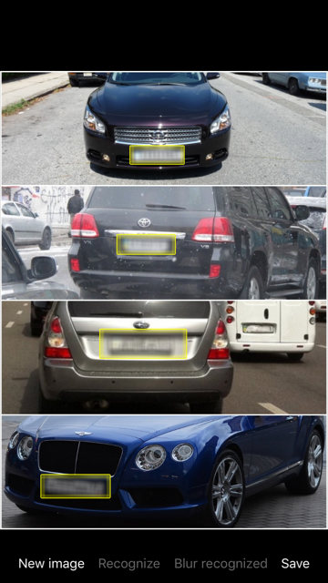

# OpenCVRecognizer
Using OpenCV-iOS from Swift simple demo

This is simple demo how to use OpenCV object detection functionality from Swift on the iOS platform.
OpenCV is written on C++, so you can't use it from Swift directly. You have to implement set of wrapper classes using Objective-C++. 

Project implements car licence plates recognizing. I use Haar cascade model from standard OpenCV delivery.

Project uses OpenCV iOS framework from http://opencv.org. 
I haven't added opencv.framework on github because is too big. So, if you want to run project you have to download opencv and add opencv.framework manually.

It's just a sample, so application crashes on big images, doesn't recognize rotated or dirty plates, etc. 
I'm planning to improve it in future.

##Application screenshot

